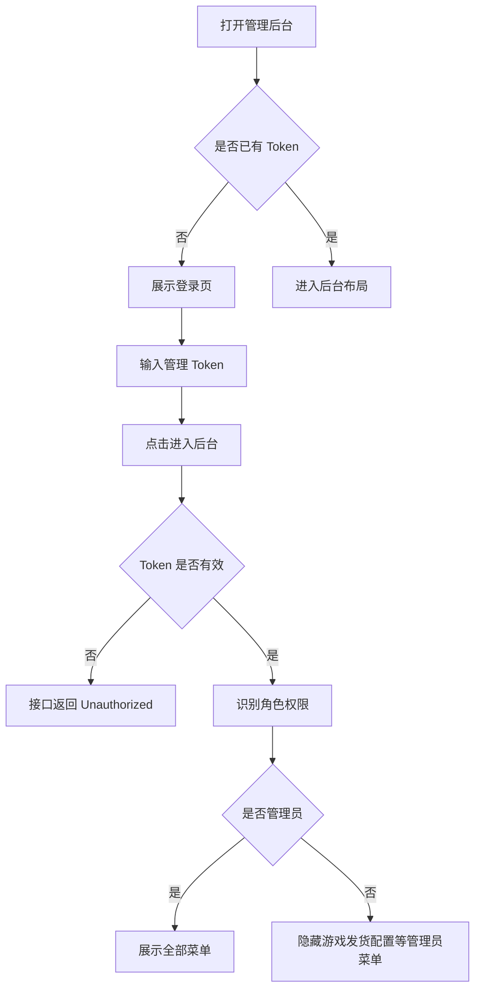
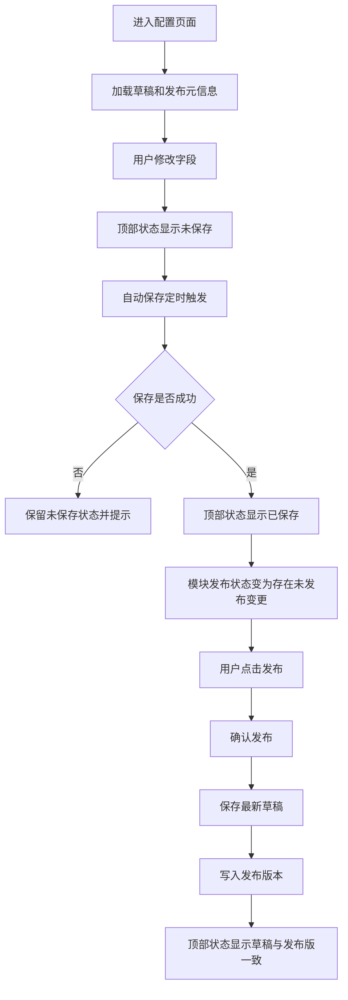
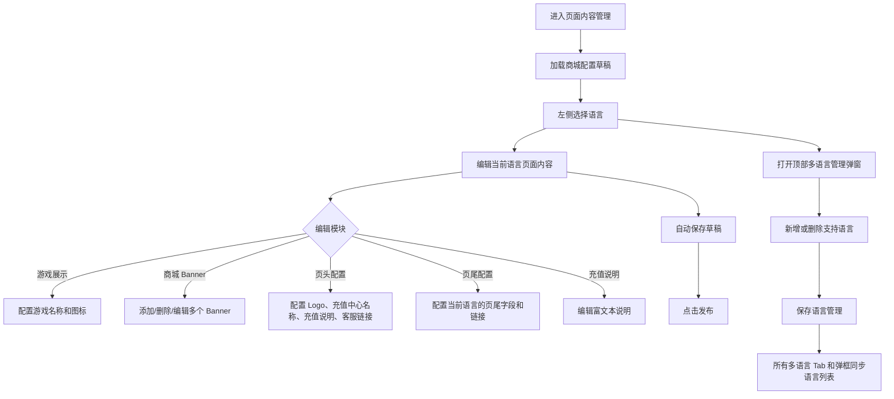
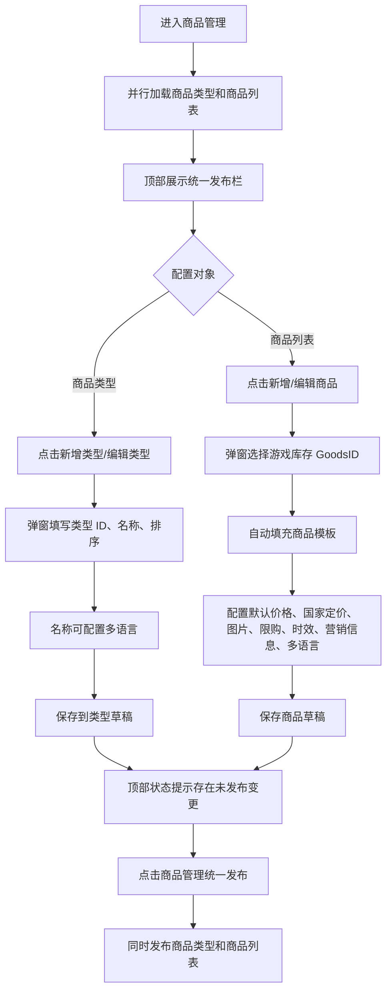
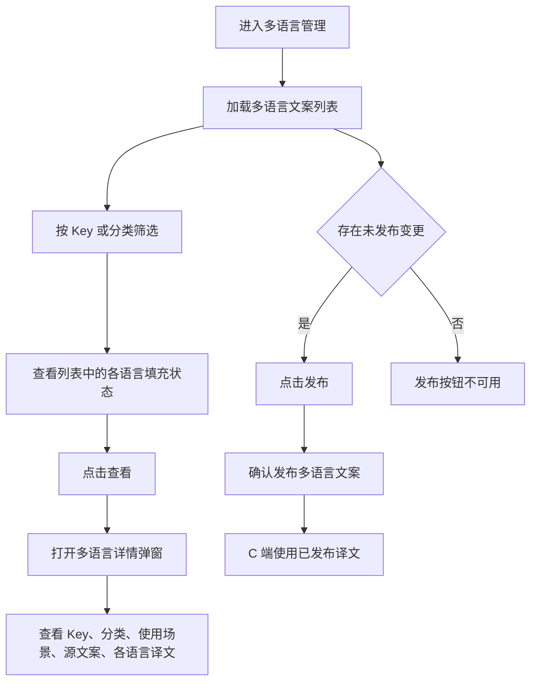
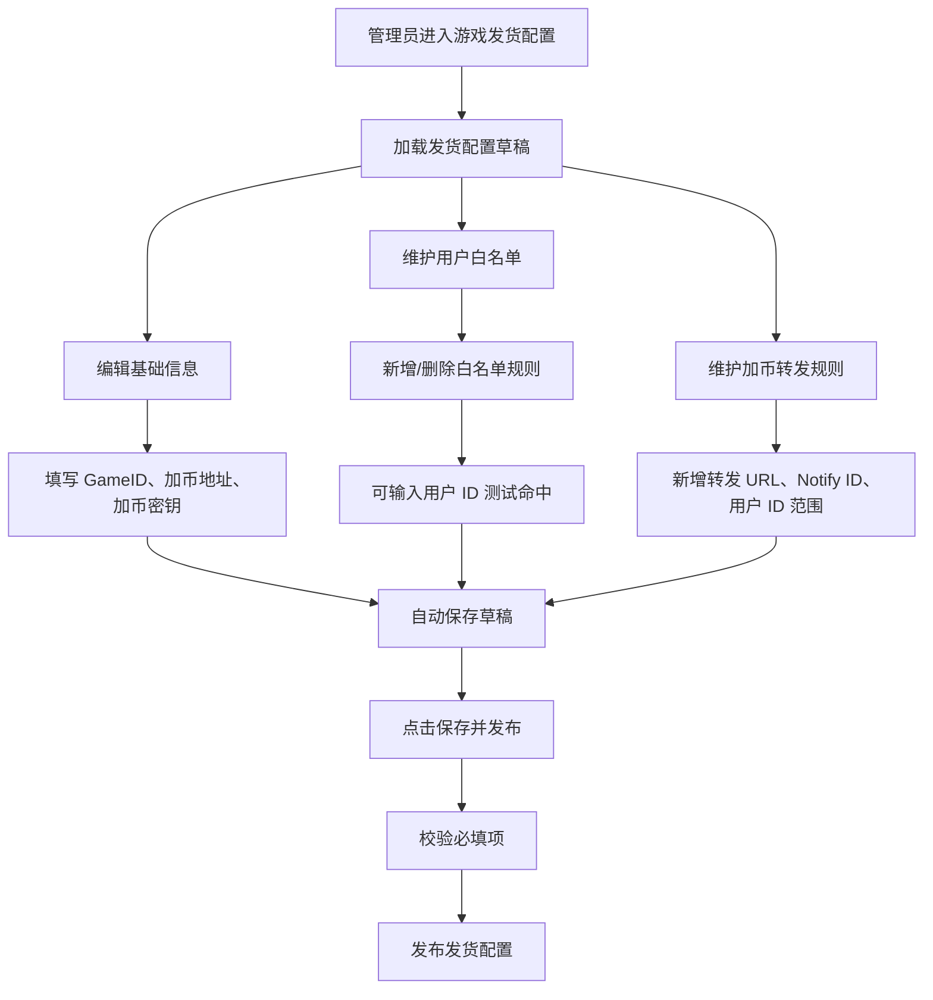
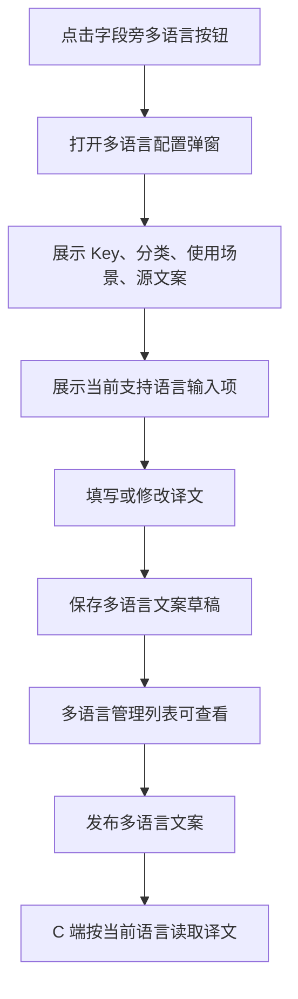

# 管理后台 PRD

## 1. 文档信息

| 项目 | 内容 |
| --- | --- |
| 产品名称 | 海外版充值商城管理后台 |
| 文档版本 | v1.0 |
| 文档范围 | 登录、页面内容管理、商品管理、多语言管理、游戏发货配置、草稿发布、自动保存 |
| 当前实现形态 | 纯前端 Demo + Mock API |

## 2. 产品背景

海外版充值商城需要按语言、地区、商品、支付和发货规则灵活配置。管理后台为运营、产品和管理员提供配置入口，用于维护 C 端展示内容、商品类型、商品信息、多语言文案、页尾字段、游戏发货参数，并通过草稿/发布机制降低误操作影响。

## 3. 产品目标

1. 为 C 端充值商城提供页面内容、商品和多语言配置能力。
2. 支持草稿编辑、自动保存、发布到线上三段式配置流程。
3. 支持按语言配置 Banner、页尾字段、充值说明、页头文案等内容。
4. 支持商品类型与商品列表在同一商品管理页面配置，并统一发布。
5. 支持多语言文案统一查看、筛选、详情查看和发布。
6. 支持管理员配置游戏发货参数、白名单和加币转发规则。
7. 支持商品多 country code、多 currency 定价，并配置默认币种和默认价格。

## 4. 用户角色与权限

| 角色 | Token | 权限说明 |
| --- | --- | --- |
| 管理员 | `demo-admin-token` | 可访问全部菜单，包括游戏发货配置 |
| 编辑 | `demo-editor-token` | 可访问内容、商品、多语言等编辑能力，不展示管理员专属入口 |
| 访客/无效 Token | 其他 | 无法通过接口鉴权 |

## 5. 菜单与信息架构

| 菜单 | 说明 | 权限 |
| --- | --- | --- |
| 页面内容管理 | 管理语言、游戏展示、商城 Banner、页头、页尾、充值说明 | 编辑及以上 |
| 商品管理 | 管理商品类型和商品列表，一个页面统一发布 | 编辑及以上 |
| 游戏发货配置 | 管理 GameID、加币地址、加币密钥、用户白名单、加币转发 | 管理员 |
| 多语言管理 | 查看和发布字段级多语言文案 | 编辑及以上 |

已去掉或不在当前后台展示的页面：营销活动管理、订单管理、运营工具。

## 6. 后台整体流程

### 6.1 登录与权限流程

### 6.2 草稿、自动保存与发布流程

### 6.3 页面内容管理流程

### 6.4 商品管理流程

### 6.5 多语言管理流程

### 6.6 游戏发货配置流程

## 7. 功能需求

### 7.1 登录与基础框架

| 编号 | 功能 | 说明 | 优先级 |
| --- | --- | --- | --- |
| A-BASE-01 | 后台登录 | 输入管理 Token 进入后台 | P0 |
| A-BASE-02 | 角色识别 | 根据 Token 识别 admin/editor/guest | P0 |
| A-BASE-03 | 菜单权限 | 非管理员不展示游戏发货配置 | P0 |
| A-BASE-04 | 顶部状态 | 当前页面展示保存中、未保存、已保存、存在未发布变更等状态 | P0 |
| A-BASE-05 | 退出登录 | 清除 Token 并回到登录页 | P1 |

### 7.2 自动保存

| 编号 | 功能 | 说明 | 优先级 |
| --- | --- | --- | --- |
| A-AUTO-01 | 自动保存触发 | 用户修改配置后延迟自动保存 | P0 |
| A-AUTO-02 | 保存状态 | 顶部原“存在未发布变更”位置展示保存中、未保存、已保存状态 | P0 |
| A-AUTO-03 | 队列处理 | 保存中继续修改时保存完成后再次 flush | P1 |
| A-AUTO-04 | 关闭前保存 | 组件卸载时若有未保存内容则尝试保存 | P1 |

### 7.3 草稿与发布

| 编号 | 功能 | 说明 | 优先级 |
| --- | --- | --- | --- |
| A-PUB-01 | 草稿版本 | 编辑内容先写入草稿，不直接覆盖发布版本 | P0 |
| A-PUB-02 | 发布版本 | 点击发布后草稿写入发布版本 | P0 |
| A-PUB-03 | 发布元信息 | 展示草稿更新时间、发布时间、是否存在未发布变更 | P0 |
| A-PUB-04 | 模块独立发布 | 页面内容、多语言、游戏发货等模块独立发布 | P0 |
| A-PUB-05 | 商品统一发布 | 商品管理页面只保留一个发布按钮，同时发布商品类型和商品列表 | P0 |

## 8. 页面内容管理

### 8.1 页面结构

| 区域 | 功能 |
| --- | --- |
| 语言版本侧栏 | 展示所有支持语言，切换当前编辑语言 |
| 多语言入口 | 打开支持语言管理弹窗 |
| 当前语言配置区 | 编辑当前语言下的游戏展示、Banner、页头、页尾、充值说明 |
| 发布栏 | 保存草稿、发布、展示发布状态 |

### 8.2 支持语言管理

| 编号 | 功能 | 说明 |
| --- | --- | --- |
| A-CONTENT-LANG-01 | 查看支持语言 | 展示当前支持语言列表 |
| A-CONTENT-LANG-02 | 添加语言 | 从可添加语言中选择并添加，生成该语言配置 |
| A-CONTENT-LANG-03 | 删除语言 | 可删除非唯一语言，并删除该语言下页面内容配置 |
| A-CONTENT-LANG-04 | 保存语言管理 | 保存后同步到所有多语言 Tab 和字段级多语言弹窗 |

### 8.3 游戏展示

| 字段 | 说明 |
| --- | --- |
| 游戏名称 | 当前语言展示的游戏名称 |
| 游戏图标 | C 端展示用图标或图片 |

### 8.4 商城 Banner

| 字段 | 说明 |
| --- | --- |
| Banner 标题 | 运营识别和展示标题 |
| Banner 图片 | 当前语言下的 Banner 图片，支持多张 |
| 跳转链接 | 点击 Banner 后打开的链接 |
| 排序 | 控制 Banner 展示顺序 |
| 启用状态 | 控制该 Banner 是否展示 |

要求：

1. 每种语言下都支持添加多个 Banner。
2. Banner 图片本身可包含多语言内容，因此按语言分组配置，不使用字段旁多语言按钮。
3. 切换语言后只编辑当前语言的 Banner 列表。

### 8.5 页头配置

| 字段 | 说明 |
| --- | --- |
| 发行主体 Logo | 页头展示 Logo |
| 充值中心名称 | C 端页头展示名称，支持多语言 |
| 充值说明文案 | C 端充值说明弹窗内容，支持多语言 |
| 客服链接 | C 端客服入口跳转地址 |

要求：

1. 页头配置不需要整体多语言 Tab。
2. 充值中心名称和充值说明文案通过多语言配置维护。

### 8.6 页尾配置

| 字段 | 说明 |
| --- | --- |
| 当前编辑语言 | 页尾按语言独立配置 |
| 发行主体 Logo | 页尾展示 Logo |
| 页尾字段列表 | 用户协议、隐私政策、联系我们、特商法、资金结算法等 |
| 自定义字段 | 可新增和删除非保护字段 |
| 页尾提示文案 | 不同语言下的免责声明或提示 |
| 版权信息 | C 端页尾版权 |

要求：

1. 页尾配置根据语言显示不同字段模板。
2. 日语等语言可包含更多法务链接，如特商法链接、资金结算法链接。
3. 支持新增配置字段和删除自定义配置字段。
4. 字段 Key 用于系统识别；字段名称/字段值用于页面展示和运营配置，不应混用。

## 9. 商品管理

### 9.1 商品类型

| 字段 | 说明 |
| --- | --- |
| 类型 ID | 商品类型唯一标识，创建后不可修改 |
| 商品类型名称 | C 端分类 Tab 展示名称，支持多语言 |
| 排序 | 控制分类排序 |

要求：

1. 类型列表和商品列表在同一商品管理页面，不拆子 Tab。
2. 新增类型通过弹窗配置。
3. 商品类型不需要“启用”字段。
4. 至少保留一个商品类型。
5. 类型 ID 需小写英文开头，仅含字母、数字、下划线或连字符。

### 9.2 商品列表

| 字段 | 说明 |
| --- | --- |
| GoodsID | 游戏库存 ID，可从游戏商品模板中选择 |
| 商品类型 | 关联商品类型 |
| 商品名称 | C 端卡片和详情展示，支持多语言 |
| 商品描述 | 到账说明/礼包内容，支持多语言 |
| 商品图片 | C 端商品图片 |
| 默认币种 | country code 未命中时使用的兜底币种 |
| 默认价格 | country code 未命中时使用的兜底售价 |
| 默认划线原价 | 可选，用于默认币种下的促销展示 |
| 国家/地区定价 | 可配置多条 country code、currency、price、originalPrice |
| 排序 | 控制商品列表顺序 |
| 是否上架 | 控制 C 端是否展示 |
| 首充双倍 | 针对源石类商品的展示规则 |
| 限购周期 | 不限购、按日、按周、按月、赛季/活动 |
| 限购上限 | 0 表示不限购 |
| 活动时效 | 活动结束时间或剩余时间展示 |
| 角标 | C 端商品卡片角标，支持多语言 |
| 营销说明 | C 端详情营销文案，支持多语言 |

要求：

1. 商品创建/编辑通过弹窗完成。
2. 选择 GoodsID 后可自动填充名称、类型、限购等模板字段。
3. 限购剩余次数由 Payment 查询 + 账号角色实时计算，后台不可直接编辑。
4. 限购周期优先以发货时间计算，避免发货延迟导致周期归属误差。
5. 不支持终身限购。
6. 活动剩余天数小于一天时，C 端展示剩余小时数。
7. 剩余时长预览支持多语言。
8. 商品必须支持多 country code 和 currency 定价配置，如 `JP + JPY`、`US + USD`。
9. 当 C 端用户 IP 解析出的 country code 命中某条国家定价时，商品列表、商品详情、收银台和订单金额使用该条定价。
10. 当 C 端用户 IP 解析出的 country code 未配置时，展示默认币种和默认价格。

### 9.3 商品多币种定价

| 字段 | 说明 |
| --- | --- |
| Country Code | ISO 3166-1 alpha-2 国家/地区代码，如 `JP`、`US` |
| Currency | ISO 4217 币种代码，如 `JPY`、`USD`、`KRW` |
| 售价 | 当前 country code 下的商品售价 |
| 划线价 | 当前 country code 下的原价，可为空 |

配置规则：

1. 默认币种和默认价格必填，作为未命中 country code 时的兜底价格。
2. 国家/地区定价支持添加多行，每行对应一个 country code；Country Code 必须通过下拉选择，不允许手输。
3. 同一商品下建议 country code 唯一；若存在重复，正式环境应阻止保存或以后端规则去重。
4. C 端使用 IP 解析出的 country code 进行匹配，Demo 中通过账号注册地模拟。
5. 发布商品后，C 端才使用最新发布版定价。
6. 俄罗斯是特殊规则：需要支持 `RU + RUB` 定价；当用户账号注册地为俄罗斯时，C 端不使用当前 IP / VPN country code，而是强制使用俄罗斯卢布定价。

## 10. 多语言管理

### 10.1 列表

| 字段 | 说明 |
| --- | --- |
| Key | 多语言文案唯一标识 |
| 分类 | 页面文案、商品名称、商品描述、商品营销、商品类型等 |
| 使用场景 | 文案在 C 端或后台中的使用位置 |
| 源文案 | 默认语言或原文 |
| 各语言状态 | 展示每种语言是否已填写 |
| 更新时间 | 最后编辑时间 |

### 10.2 筛选

| 筛选项 | 说明 |
| --- | --- |
| Key 关键字 | 支持模糊搜索 |
| 分类 | 按文案分类筛选 |

### 10.3 详情

| 内容 | 说明 |
| --- | --- |
| 基础信息 | Key、分类、使用场景、源文案 |
| 语言译文 | 当前支持语言的译文内容 |
| 查看方式 | 当前实现为查看详情；字段级多语言弹窗负责新增/编辑 |

### 10.4 发布

1. 多语言管理页面可发布多语言文案。
2. 发布后 C 端读取已发布译文。
3. 多语言管理页面顶部导航不展示“存在未发布变更”类状态，但模块内发布栏保留发布能力。

## 11. 游戏发货配置

### 11.1 基础信息

| 字段 | 说明 | 必填 |
| --- | --- | --- |
| GameID | 游戏标识 | 是 |
| 加币地址 | 加币服务地址 | 是 |
| 加币密钥 | 加币签名密钥 | 是 |

说明：Demo 中默认不内置加币地址和密钥，需要管理员填写。

### 11.2 用户白名单

| 字段 | 说明 |
| --- | --- |
| 用户 ID / 规则 | 支持精确用户 ID 或正则规则 |
| 用户 id 测试 | 输入用户 ID 后测试是否命中白名单 |

### 11.3 加币转发

| 字段 | 说明 |
| --- | --- |
| 转发 URL | 加币回调或通知转发地址 |
| Notify ID | 转发通知标识 |
| 用户 ID 范围 | 逗号或换行分隔 |

### 11.4 校验规则

1. GameID 必填。
2. 加币地址必填。
3. 加币密钥必填。
4. 白名单空行不保存。
5. 转发规则中 URL、Notify ID、用户 ID 至少有一项时保留。

## 12. 字段级多语言配置

### 12.1 触发位置

| 位置 | 示例字段 |
| --- | --- |
| 商品类型弹窗 | 商品类型名称 |
| 商品弹窗 | 商品名称、商品描述、角标、营销说明 |
| 页面内容配置 | 充值中心名称、充值说明文案等需要 C 端展示的文字 |

### 12.2 配置逻辑

### 12.3 Key 规则

1. Key 仅支持小写字母、数字、下划线和点号。
2. Key 用于系统定位文案，不等同于页面展示名称。
3. 字段名称用于运营识别；字段值用于 C 端展示。

## 13. 数据与接口

### 13.1 管理后台 Mock API

| 模块 | 接口能力 |
| --- | --- |
| 发布状态 | `publishStatus` |
| 页面内容 | `mallConfig.get`、`mallConfig.saveDraft`、`mallConfig.publish` |
| 商品 | `products.list`、`products.create`、`products.update`、`products.remove`、`products.publish` |
| 游戏商品模板 | `gameGoods.list` |
| 商品类型 | `productCategories.list`、`productCategories.saveDraft`、`productCategories.publish` |
| 多语言 | `translations.list`、`translations.save`、`translations.publish` |
| 游戏发货 | `gameDelivery.get`、`gameDelivery.saveDraft`、`gameDelivery.publish` |

### 13.2 存储模型

| 数据 | 草稿 | 发布版 |
| --- | --- | --- |
| 页面内容 | `mallConfigDraft` | `mallConfigPublished` |
| 商品 | `productsDraft` | `productsPublished` |
| 商品类型 | `productCategoriesDraft` | `productCategoriesPublished` |
| 多语言 | `translationsDraft` | `translationsPublished` |
| 游戏发货 | `gameDeliveryDraft` | `gameDeliveryPublished` |

## 14. 异常与边界场景

| 场景 | 处理方式 |
| --- | --- |
| Token 无效 | 接口返回 Unauthorized |
| 非管理员访问管理员菜单 | 前端隐藏入口，接口仍需鉴权 |
| 自动保存失败 | 保持未保存状态并允许手动保存 |
| 商品类型全部删除 | 阻止保存，提示至少保留一个类型 |
| 类型 ID 重复 | 阻止保存并提示重复 |
| GoodsID 重复 | 阻止商品保存 |
| 删除语言 | 同步删除该语言下页面配置，至少保留一种语言 |
| 页尾删除保护字段 | 基础字段不可删除，仅自定义字段可删除 |
| 游戏发货缺少必填项 | 保存/发布失败并提示必填项 |

## 15. 非功能需求

1. 所有配置页需要自动保存，降低电脑故障或忘记保存造成的数据丢失。
2. 关键删除和发布操作需要二次确认。
3. 表单修改后状态反馈必须即时、明确。
4. 后台配置需与 C 端展示字段一一对应，避免字段含义混淆。
5. 管理后台需要适配常规桌面分辨率，保证表格、弹窗和发布栏可用。

## 16. 后续待确认

1. 正式环境权限体系：是否接入公司 SSO、RBAC、操作日志。
2. 发布机制：是否需要审批流、灰度发布、回滚版本。
3. 图片上传：正式对象存储、尺寸校验、压缩和 CDN 刷新策略。
4. 多语言翻译：是否接入机器翻译、翻译状态流转、导入导出。
5. 商品和发货接口：正式 Payment、游戏库存、加币服务的字段协议和错误码。
