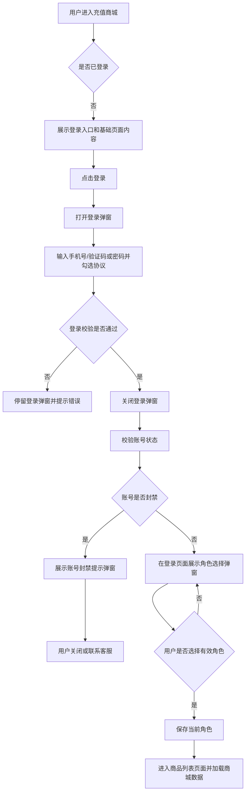
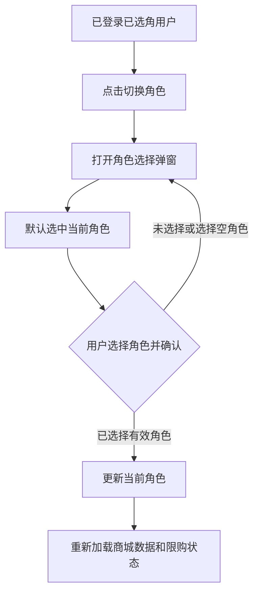
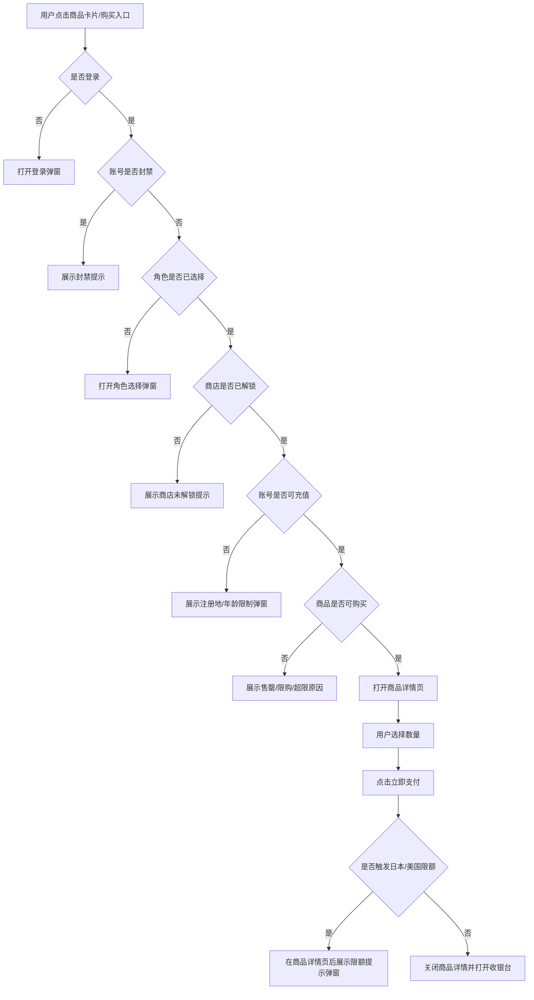
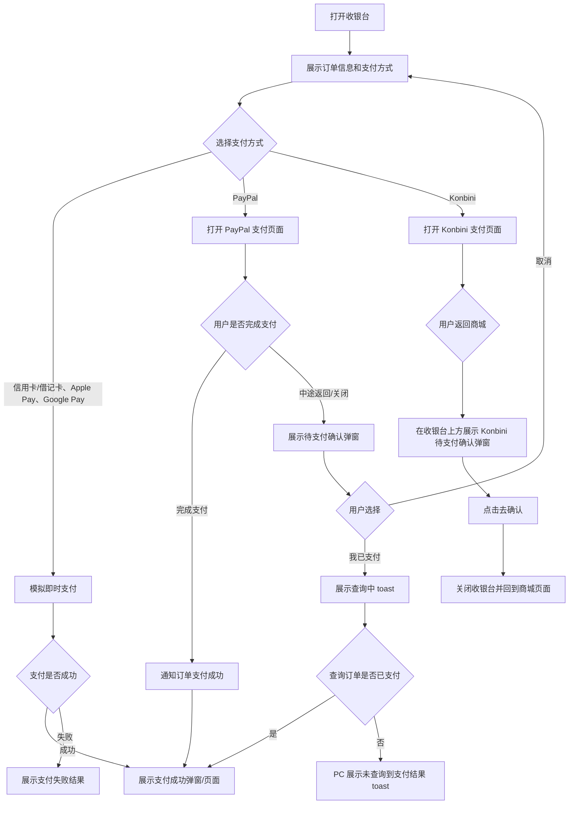
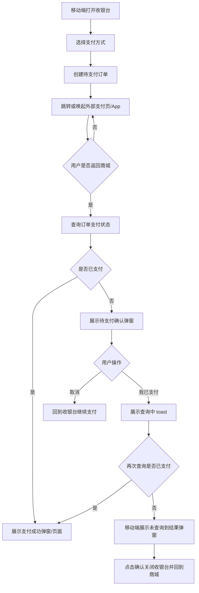

# C端充值商城 PRD

## 1. 文档信息

| 项目 | 内容 |
| --- | --- |
| 产品名称 | 海外版充值商城 C 端 |
| 文档版本 | v1.0 |
| 文档范围 | C 端商城首页、登录、角色选择、商品浏览、商品详情、限额拦截、收银台、支付结果 |
| 当前实现形态 | 纯前端 Demo + Mock API |

## 2. 产品背景

海外版充值商城面向海外服用户提供网页充值能力。用户进入商城后，可切换语言，查看对应语言下的页头、Banner、商品、充值说明和页尾信息；登录并选择角色后，才可查看可购买商品并发起支付。系统需要覆盖日本、美国注册地的未成年人充值限制，以及 PayPal、Konbini 等海外支付方式的差异化流程。

## 3. 产品目标

1. 提供海外服充值商城的完整 C 端浏览和支付闭环。
2. 支持简中、繁中、英语、日语、韩语等多语言展示。
3. 用户登录后必须先完成账号状态校验和角色选择，再进入商品列表。
4. 支持按注册地和年龄展示日本、美国充值限制，并在超限时阻断支付。
5. 支持 PayPal、Konbini 及移动端 H5 支付中断/回流确认流程。
6. 页头、页尾、Banner、充值说明等内容均可由管理后台配置并在 C 端展示。
7. 商品价格根据用户 IP 对应的 country code 自动切换；未配置地区回退默认币种和默认价格。

## 4. 用户角色

| 角色 | 说明 | 核心诉求 |
| --- | --- | --- |
| 未登录用户 | 首次进入商城或未登录状态用户 | 查看基础页面内容，发起登录 |
| 已登录未选角用户 | 登录成功但未选择角色 | 选择需要充值的游戏角色 |
| 已登录已选角用户 | 已完成角色选择 | 查看商品、发起充值、完成支付 |
| 受限用户 | 账号封禁、未解锁商店、未成年人限额用户 | 获得明确原因提示和客服入口 |

## 5. 访问入口与页面结构

### 5.1 访问地址

- Demo 预览：`http://localhost:4173/`
- 开发环境：`http://localhost:5173/`

### 5.2 页面模块

| 模块 | 展示内容 | 备注 |
| --- | --- | --- |
| 页头 | 发行主体 Logo、充值中心名称、充值说明入口、客服入口、多语言选择、登录/账号信息 | Logo、名称、说明文案、客服链接来自后台配置 |
| Banner | 当前语言下的多个 Banner | Banner 图片、标题、跳转链接按语言独立配置 |
| 登录区/角色信息区 | 登录按钮、账号、角色、切换角色 | 未登录显示登录提示；已选角显示账号和角色信息 |
| 商品分类 Tab | 全部及后台配置的商品类型 | 商品类型名称支持多语言 |
| 商品列表 | 商品图片、名称、描述、币种价格、角标、剩余时长、限购状态 | 商品按分类和排序展示；币种价格按 country code 命中 |
| 页尾 | 发行主体 Logo、协议链接、客服信息、版权、免责声明 | 不同语言的页尾字段可不同 |
| 弹窗层 | 登录、角色选择、商品详情、限额提示、封禁提示、收银台、支付结果 | 支持 PC 与移动端适配 |

## 6. 核心业务流程

### 6.1 用户登录与角色选择流程

### 6.2 切换角色流程

### 6.3 商品购买流程

### 6.4 PC 收银台流程

### 6.5 移动端 H5 支付回流流程

## 7. 功能需求

### 7.1 多语言展示

| 编号 | 功能 | 说明 | 优先级 |
| --- | --- | --- | --- |
| C-I18N-01 | 语言切换 | 支持简中、繁中、英语、日语、韩语，以及后台新增语言 | P0 |
| C-I18N-02 | 页面文案切换 | 充值中心名称、充值说明、商品名称、商品描述、商品角标、营销说明、剩余时长、按钮文案等跟随当前语言展示 | P0 |
| C-I18N-03 | Banner 多语言 | 不同语言展示各自配置的 Banner 列表 | P0 |
| C-I18N-04 | 页尾多语言 | 不同语言展示不同协议项和页尾字段 | P0 |
| C-I18N-05 | 兜底规则 | 当前语言缺失时优先回退默认配置或简中文案 | P1 |

### 7.2 登录

| 编号 | 功能 | 说明 | 优先级 |
| --- | --- | --- | --- |
| C-LOGIN-01 | 登录入口 | 未登录时页头展示登录按钮 | P0 |
| C-LOGIN-02 | 登录弹窗 | 支持短信验证码、密码两种演示登录模式 | P0 |
| C-LOGIN-03 | 协议勾选 | 未勾选协议时不可提交登录 | P0 |
| C-LOGIN-04 | 演示账号快捷入口 | 支持商店未解锁、账号封禁、日本/美国限额等演示账号 | P1 |
| C-LOGIN-05 | 登录成功后流程 | 登录成功后先校验账号状态，未封禁才进入角色选择 | P0 |

### 7.3 账号状态校验

| 编号 | 功能 | 说明 | 优先级 |
| --- | --- | --- | --- |
| C-ACCOUNT-01 | 封禁校验 | 登录成功后、角色选择前校验账号封禁状态 | P0 |
| C-ACCOUNT-02 | 封禁提示 | 封禁账号展示封禁原因和封禁时间 | P0 |
| C-ACCOUNT-03 | 客服入口 | 封禁提示中提供联系客服能力 | P1 |
| C-ACCOUNT-04 | 充值限制数据 | 获取账号注册地、年龄、月累计充值、剩余额度等数据 | P0 |

### 7.4 角色选择

| 编号 | 功能 | 说明 | 优先级 |
| --- | --- | --- | --- |
| C-ROLE-01 | 登录后强制选角 | 用户登录成功后不默认选择角色，必须确认一个有效角色才进入商品列表 | P0 |
| C-ROLE-02 | 角色选择弹窗 | 展示角色名、服务器、角色 ID 等信息 | P0 |
| C-ROLE-03 | 关闭按钮 | 弹窗右上角提供关闭按钮 | P0 |
| C-ROLE-04 | 空角色处理 | 无角色服务器不可确认 | P0 |
| C-ROLE-05 | 切换角色 | 已选角用户可打开角色选择器，默认选中当前角色 | P0 |

### 7.5 商城首页与商品列表

| 编号 | 功能 | 说明 | 优先级 |
| --- | --- | --- | --- |
| C-MALL-01 | 商城数据加载 | 根据账号和角色加载商店解锁状态、商品、分类、限额 | P0 |
| C-MALL-02 | 商店未解锁提示 | 角色未解锁游戏内商店时不展示商品，并弹窗提示 | P0 |
| C-MALL-03 | 商品分类 | 按商品类型展示分类 Tab，支持全部分类 | P0 |
| C-MALL-04 | 商品卡片 | 展示商品图、名称、描述、价格、角标、限购、剩余时长 | P0 |
| C-MALL-05 | 售罄与不可购 | 达到限购、活动结束、限额超限时展示不可购买状态 | P0 |
| C-MALL-06 | 活动剩余时长 | 剩余天数大于等于 1 天展示天数，小于 1 天展示小时数 | P0 |
| C-MALL-07 | 多币种价格展示 | 根据用户 IP 识别出的 country code 匹配商品国家定价，展示对应 currency 和 price | P0 |
| C-MALL-08 | 默认币种兜底 | 当 country code 未配置时，商品列表、详情和收银台展示默认币种和默认价格 | P0 |

### 7.6 商品详情

| 编号 | 功能 | 说明 | 优先级 |
| --- | --- | --- | --- |
| C-DETAIL-01 | 详情弹窗 | 点击可购买商品进入商品详情 | P0 |
| C-DETAIL-02 | 数量选择 | 根据限购剩余次数控制可选数量 | P0 |
| C-DETAIL-03 | 总价计算 | 根据单价和数量实时计算总价 | P0 |
| C-DETAIL-04 | 立即支付 | 点击后进行限额校验，合规则打开收银台 | P0 |
| C-DETAIL-05 | 限额弹窗 | 日本未成年人累充限额场景在点击立即支付后出现提示弹窗 | P0 |

### 7.7 充值限额

| 编号 | 规则 | 说明 |
| --- | --- | --- |
| C-LIMIT-01 | 注册地判断 | 按注册时 IP 判断，日本和美国适用不同规则；注册地和用户信息可联系客服修改 |
| C-LIMIT-02 | 日本未满 16 岁 | 月累计充值不超过 5,000 日元 |
| C-LIMIT-03 | 日本大于等于 16 岁且小于 20 岁 | 月累计充值不超过 20,000 日元，超限后无法支付并弹出提示 |
| C-LIMIT-04 | 美国未满 13 岁 | 未完成家长管控验证时不可支付 |
| C-LIMIT-05 | 美国 13-16 岁 | 未完成家长管控验证时不可支付 |
| C-LIMIT-06 | 成人用户 | 默认无充值限额 |
| C-LIMIT-07 | 统计口径 | 同一游戏账号体系下全平台统一统计，不同区服角色共用支付限额 |

### 7.8 多币种定价

| 编号 | 规则 | 说明 |
| --- | --- | --- |
| C-PRICE-01 | country code 来源 | 正式环境按用户 IP 解析 country code；Demo 中通过账号注册地模拟 JP/US 等 country code |
| C-PRICE-02 | 命中定价 | 商品存在对应 country code 定价时，C 端展示该定价的 currency、price、originalPrice |
| C-PRICE-03 | 未命中兜底 | 商品不存在对应 country code 定价时，展示后台配置的默认币种和默认价格 |
| C-PRICE-04 | 全链路一致 | 商品列表、商品详情、收银台、订单金额、支付结果均使用同一套命中定价 |
| C-PRICE-05 | 限额计算 | 支付限额校验使用当前展示/下单的价格金额；日本 IP 命中 JPY 定价后按日元金额校验 |
| C-PRICE-06 | 俄罗斯注册地锁定 | 当账号注册地国家为俄罗斯时，无论用户是否通过 VPN 切换 IP，商品列表、详情、收银台和订单金额均强制使用俄罗斯卢布 RUB 定价 |
| C-PRICE-07 | IP 切换演示 | Demo 提供模拟 IP country code 切换控件，用于验证普通账号按 IP country code 切价、俄罗斯注册地账号不受 IP 切换影响 |

### 7.9 收银台与支付

| 编号 | 功能 | 说明 | 优先级 |
| --- | --- | --- | --- |
| C-PAY-01 | 收银台 | 展示订单标题、商品价格、总价、支付协议、支付方式 | P0 |
| C-PAY-02 | PC 支付方式 | 支持信用卡/借记卡、PayPal、Apple Pay、Google Pay、Konbini | P0 |
| C-PAY-03 | PayPal 流程 | 点击 PayPal 打开 PayPal 支付页，成功后回商城展示支付成功；中途返回展示确认弹窗 | P0 |
| C-PAY-04 | Konbini 流程 | 点击 Konbini 打开便利店支付页，返回商城后展示专属待支付确认弹窗 | P0 |
| C-PAY-05 | 支付查询 | 点击“我已支付”展示查询 toast，按订单状态展示成功或未支付结果 | P0 |
| C-PAY-06 | 移动端适配 | 收银台、支付确认、未查询到结果、Konbini 流程支持 H5 小屏展示 | P0 |
| C-PAY-07 | 支付会话保持 | 外部支付页返回后通过 session 保留待支付订单和支付渠道 | P1 |

## 8. 异常与边界场景

| 场景 | 处理方式 |
| --- | --- |
| 未登录点击购买 | 打开登录弹窗 |
| 登录账号被封禁 | 展示封禁提示，隐藏角色选择，不进入商品列表 |
| 角色未解锁商店 | 展示未解锁提示，商品列表为空 |
| 无效角色 | 不允许确认选择 |
| 商品下架或不存在 | 提示商品不可用 |
| 超出限购数量 | 阻止下单并提示最多可购数量 |
| 超出日本月限额 | 阻止支付并弹出充值限制提示 |
| 美国未成年人未验证 | 阻止支付并提示需家长管控验证 |
| PayPal 中途返回 | 弹出待支付确认，取消回收银台，已支付触发查询 |
| Konbini 中途返回 | 弹出 Konbini 专属待支付确认，确认后关闭收银台 |
| 支付结果未查询到 | PC 展示 toast，移动端展示弹窗并关闭收银台 |

## 9. 数据与接口

### 9.1 C 端 Mock API

| 接口能力 | 用途 |
| --- | --- |
| `getMallConfig` | 获取页面配置、页头页尾、Banner、语言配置 |
| `getTranslations` | 获取已发布多语言文案 |
| `getProductCategories` | 获取商品分类 |
| `getRoles` | 获取可选角色列表 |
| `getAccountStatus` | 获取账号封禁和充值限制 |
| `getMall` | 根据账号和角色获取商城商品、商店状态、限额 |
| `createOrder` | 创建订单，支持 pendingOnly 待支付订单 |
| `getOrderPaymentStatus` | 查询订单是否已支付 |
| `notifyOrderPaid` | 模拟外部支付完成回调 |

### 9.2 关键数据

| 数据 | 字段示例 | 说明 |
| --- | --- | --- |
| 角色 | `id`、`name`、`server`、`roleId`、`storeUnlocked` | 控制角色展示和商店解锁 |
| 商品 | `id`、`goodsId`、`category`、`price`、`limitMax`、`timeLimitEnd` | 控制商品展示、限购、活动时效 |
| 限额 | `country`、`ageTier`、`monthlyMax`、`monthlySpent`、`monthlyRemaining` | 控制限额展示和支付拦截 |
| 订单 | `orderId`、`accountId`、`roleId`、`productId`、`amount`、`status` | 控制支付状态查询 |
| 页面配置 | `languages`、`header`、`footer`、`banners` | 控制多语言内容展示 |

## 10. 非功能需求

1. PC 和移动端 H5 均需适配，重点保证收银台和弹窗在小屏可用。
2. 支付流程必须保留状态，避免用户从外部支付页返回后丢失订单。
3. 多语言缺失时需有明确兜底，避免页面出现空白关键文案。
4. 限额和封禁提示必须在关键路径前置，避免用户进入不可完成的支付流程。
5. C 端展示依赖已发布配置，草稿内容不应直接影响用户页面。

## 11. 后续待确认

1. 正式环境支付渠道的真实跳转、回调、订单状态查询接口。
2. 日本和美国未成年人限额规则是否需要按当地法律动态更新。
3. 家长管控验证流程是否内嵌商城，还是跳转外部认证页。
4. Konbini 便利店支付页面字段、过期时间、支付码展示是否由支付服务返回。
5. 管理后台发布后是否实时同步 C 端，还是需要独立发布/缓存刷新机制。
